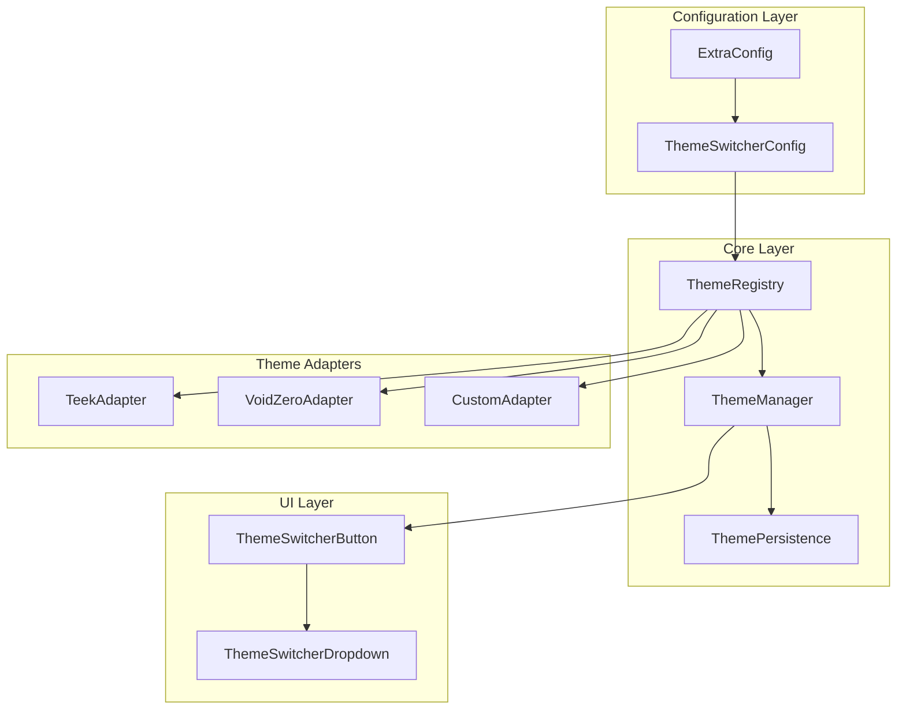

# 设计文档：VitePress 主题切换器

## 概述

本设计文档描述了为 `@ruan-cat/vitepress-preset-config` 包实现 VitePress 主题动态切换功能的技术方案。该功能允许用户在运行时通过导航栏按钮切换不同的 VitePress 主题，无需页面刷新。

### 核心设计目标

1. **无侵入性** - 不修改现有 API 的默认行为，确保向后兼容
2. **可扩展性** - 采用注册表模式，便于未来添加新主题
3. **运行时切换** - 通过动态样式注入实现无刷新主题切换
4. **持久化** - 使用 localStorage 保存用户主题偏好

## 架构设计



### 架构说明

1. **Configuration Layer（配置层）** - 扩展现有 ExtraConfig 接口
2. **Core Layer（核心层）** - 包含主题注册、管理和持久化逻辑
3. **UI Layer（UI 层）** - 提供导航栏主题切换组件
4. **Theme Adapters（主题适配器）** - 封装各主题的特定配置

## 组件与接口

### 1. ThemeRegistry（主题注册表）

负责管理所有可用主题的注册和查询。

```typescript
// src/theme-switcher/registry.ts

export interface ThemeDefinition {
	/** 主题唯一标识符 */
	id: string;
	/** 主题显示名称 */
	name: string;
	/** 主题描述 */
	description?: string;
	/** 主题图标 (可选，用于 UI 显示) */
	icon?: string;
	/** VitePress Theme 对象 */
	theme: Theme;
	/** 主题样式文件路径列表 */
	styles?: string[];
	/** 主题特定的 CSS 变量 */
	cssVars?: Record<string, string>;
	/** 主题清理函数 (切换离开时调用) */
	cleanup?: () => void;
}

export interface ThemeRegistry {
	/** 注册主题 */
	register(theme: ThemeDefinition): void;
	/** 获取主题 */
	get(id: string): ThemeDefinition | undefined;
	/** 获取所有主题 */
	getAll(): ThemeDefinition[];
	/** 检查主题是否存在 */
	has(id: string): boolean;
	/** 获取主题数量 */
	size(): number;
}
```

### 2. ThemeManager（主题管理器）

负责主题切换的核心逻辑。

```typescript
// src/theme-switcher/manager.ts

export interface ThemeManager {
	/** 获取当前激活的主题 ID */
	getCurrentTheme(): string;
	/** 切换到指定主题 */
	switchTheme(themeId: string): Promise<void>;
	/** 获取可用主题列表 */
	getAvailableThemes(): ThemeDefinition[];
	/** 初始化主题管理器 */
	initialize(defaultTheme?: string): void;
}
```

### 3. ThemePersistence（主题持久化）

负责主题偏好的存储和恢复。

```typescript
// src/theme-switcher/persistence.ts

export interface ThemePersistence {
	/** 保存主题偏好 */
	save(themeId: string): void;
	/** 加载主题偏好 */
	load(): string | null;
	/** 清除主题偏好 */
	clear(): void;
}
```

### 4. ThemeSwitcherConfig（配置接口）

扩展 ExtraConfig 的主题切换器配置。

```typescript
// src/types.ts (扩展)

export interface ThemeSwitcherConfig {
	/** 是否启用主题切换器，默认 false */
	enabled?: boolean;
	/** 默认主题 ID，默认 'teek' */
	defaultTheme?: string;
	/** 可用主题列表，为空则使用所有内置主题 */
	themes?: string[];
	/** 持久化存储的 key，默认 'vitepress-theme' */
	storageKey?: string;
	/** 自定义主题定义 */
	customThemes?: ThemeDefinition[];
	/** 切换按钮的位置，默认 'nav' */
	buttonPosition?: "nav" | "sidebar";
	/** 切换按钮的文本，默认 '主题' */
	buttonText?: string;
}

// 扩展 ExtraConfig
export interface ExtraConfig {
	// ... 现有配置

	/** 主题切换器配置 */
	themeSwitcher?: ThemeSwitcherConfig;
}
```

### 5. ThemeSwitcherButton（Vue 组件）

导航栏主题切换按钮组件。

```typescript
// src/theme-switcher/components/ThemeSwitcherButton.vue

interface Props {
	/** 当前主题 ID */
	currentTheme: string;
	/** 可用主题列表 */
	themes: ThemeDefinition[];
	/** 按钮文本 */
	buttonText?: string;
}

interface Emits {
	/** 主题切换事件 */
	(e: "switch", themeId: string): void;
}
```

## 数据模型

### 主题定义数据结构

```typescript
// 内置 Teek 主题定义
const teekThemeDefinition: ThemeDefinition = {
	id: "teek",
	name: "Teek",
	description: "vitepress-theme-teek 主题",
	theme: TeekTheme,
	styles: [
		"vitepress-theme-teek/index.css",
		"vitepress-theme-teek/theme-chalk/tk-doc-h1-gradient.css",
		"vitepress-theme-teek/theme-chalk/tk-nav-blur.css",
		"vitepress-theme-teek/theme-chalk/tk-scrollbar.css",
		"vitepress-theme-teek/theme-chalk/tk-sidebar.css",
		"vitepress-theme-teek/theme-chalk/tk-aside.css",
		"vitepress-theme-teek/theme-chalk/tk-fade-up-animation.css",
	],
};

// 内置 VoidZero 主题定义
const voidZeroThemeDefinition: ThemeDefinition = {
	id: "voidzero",
	name: "VoidZero",
	description: "@voidzero-dev/vitepress-theme 主题 (Vite 官方风格)",
	theme: VoidZeroTheme,
	styles: ["@voidzero-dev/vitepress-theme/style"],
};
```

### 持久化数据结构

```typescript
interface PersistedThemeData {
	/** 主题 ID */
	themeId: string;
	/** 保存时间戳 */
	timestamp: number;
	/** 版本号 (用于未来迁移) */
	version: number;
}
```

## 正确性属性

_属性是指在系统所有有效执行中都应保持为真的特征或行为——本质上是关于系统应该做什么的形式化陈述。属性是人类可读规范与机器可验证正确性保证之间的桥梁。_

基于预分析，已识别出以下正确性属性：

### Property 1: 主题应用一致性

*对于任意*注册表中的有效主题 ID，当选择该主题时，ThemeManager SHALL 应用该主题，且当前主题状态 SHALL 等于所选主题 ID。
**Validates: Requirements 1.2**

### Property 2: 主题显示同步

*对于任意*主题应用操作，UI 按钮显示文本 SHALL 与当前激活主题的名称匹配。
**Validates: Requirements 1.3**

### Property 3: 主题持久化往返

*对于任意*有效主题 ID，将其保存到持久化存储然后加载回来 SHALL 返回相同的主题 ID。
**Validates: Requirements 1.4**

### Property 4: 向后兼容性 - defineRuancatPresetTheme

*对于任意*不带主题切换器配置的 `defineRuancatPresetTheme` 有效输入参数，输出 SHALL 与原始实现的输出结构等价。
**Validates: Requirements 2.2**

### Property 5: 向后兼容性 - setUserConfig

*对于任意*不带主题切换器配置的 `setUserConfig` 有效输入参数，输出 SHALL 与原始实现的输出结构等价。
**Validates: Requirements 2.3**

### Property 6: 主题注册接受性

*对于任意*有效的 ThemeDefinition 对象，向 ThemeRegistry 注册 SHALL 成功，且后续通过 ID 检索 SHALL 返回相同的主题定义。
**Validates: Requirements 3.1**

### Property 7: 自定义主题合并

*对于任意*通过配置提供的自定义主题集合，ThemeRegistry SHALL 同时包含自定义主题和所有内置主题（除非明确过滤）。
**Validates: Requirements 3.3**

### Property 8: 主题覆盖行为

*对于任意*注册两次的主题 ID，ThemeRegistry 在查询时 SHALL 返回后注册的版本。
**Validates: Requirements 3.4**

### Property 9: 主题查找正确性

*对于任意*主题 ID，如果该 ID 存在于注册表中，`get(id)` SHALL 返回主题定义；如果该 ID 不存在，`get(id)` SHALL 返回 undefined。
**Validates: Requirements 3.5**

### Property 10: 默认主题配置

*对于任意*在配置中指定的有效默认主题 ID，首次访问时的初始激活主题 SHALL 等于配置的默认主题。
**Validates: Requirements 4.3**

### Property 11: 主题过滤

*对于任意*配置中的非空主题数组，ThemeRegistry 中的可用主题 SHALL 恰好是配置主题与已注册主题的交集。
**Validates: Requirements 4.4**

### Property 12: CSS 动态更新

*对于任意*主题切换操作，文档的样式表 SHALL 更新为包含新主题的样式并排除前一主题的专属样式。
**Validates: Requirements 5.2**

### Property 13: VoidZero 主题清理

*对于任意*从 VoidZero 主题切换到其他主题的操作，所有 VoidZero 特定的样式元素 SHALL 从文档中移除。
**Validates: Requirements 6.4**

## 错误处理

### 错误类型定义

```typescript
export class ThemeSwitcherError extends Error {
	constructor(
		message: string,
		public code: ThemeErrorCode,
		public cause?: Error,
	) {
		super(message);
		this.name = "ThemeSwitcherError";
	}
}

export enum ThemeErrorCode {
	THEME_NOT_FOUND = "THEME_NOT_FOUND",
	THEME_LOAD_FAILED = "THEME_LOAD_FAILED",
	STYLE_INJECTION_FAILED = "STYLE_INJECTION_FAILED",
	PERSISTENCE_FAILED = "PERSISTENCE_FAILED",
	INVALID_CONFIGURATION = "INVALID_CONFIGURATION",
}
```

### 错误处理策略

1. **主题未找到** - 回退到默认主题，记录警告日志
2. **样式加载失败** - 保持当前主题，显示错误提示
3. **持久化失败** - 继续运行但不保存偏好，记录警告日志
4. **配置无效** - 使用默认配置，记录错误日志

## 测试策略

### 测试框架选择

- **单元测试**: Vitest
- **属性测试**: fast-check（与 Vitest 集成）
- **组件测试**: @vue/test-utils

### 单元测试覆盖

1. **ThemeRegistry**
   - 主题注册和查询
   - 重复注册覆盖行为
   - 边界条件（空注册表、无效 ID）

2. **ThemeManager**
   - 主题切换逻辑
   - 初始化流程
   - 错误处理

3. **ThemePersistence**
   - localStorage 读写
   - 数据验证
   - 降级处理

### 属性测试覆盖

使用 fast-check 库实现属性测试，验证以下核心属性：

1. **Property 3: 主题持久化往返** - 持久化往返一致性
2. **Property 6: 主题注册接受性** - 注册接受性
3. **Property 8: 主题覆盖行为** - 覆盖行为
4. **Property 9: 主题查找正确性** - 查找正确性

### 测试文件结构

```plain
packages/vitepress-preset-config/src/
├── theme-switcher/
│   ├── __tests__/
│   │   ├── registry.test.ts
│   │   ├── manager.test.ts
│   │   ├── persistence.test.ts
│   │   └── properties.test.ts  # 属性测试
│   └── ...
```
