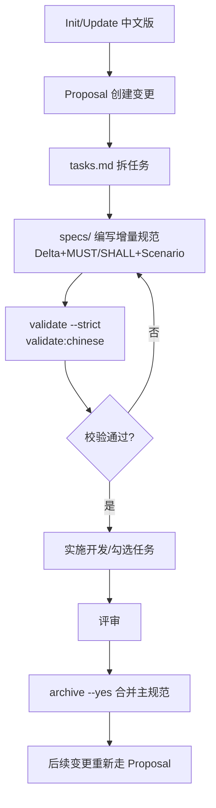

# OpenSpec 中文版规范助手

这是一个专门用于辅助使用 OpenSpec 中文版（`@org-hex/openspec-chinese`）的技能。

## 核心职责

1. 指导用户正确使用 OpenSpec 中文版工具
2. 帮助创建和管理规范变更提案
3. 协助编写符合格式要求的规格文档
4. 校验规格文档格式并提供修复建议
5. 管理规格文档的全生命周期

## 环境与安装要求

### 基本环境

- Node.js >= 20.19.0（项目本身使用 Node 22 也兼容）
- 推荐全局安装：`pnpm install -g @org-hex/openspec-chinese@latest`

### 校验安装

```bash
openspec-chinese --version
openspec-chinese --help
```

### 临时使用

如果不想全局安装，可以使用：

```bash
pnpm dlx @org-hex/openspec-chinese init
pnpm dlx @org-hex/openspec-chinese proposal "功能描述"
```

## OpenSpec 项目结构

初始化后会生成以下核心结构：

```plain
openspec/
├── project.md      # 项目上下文（技术栈、约定等）
├── AGENTS.md       # AI 助手指令
├── specs/          # 现行规范（已归档的事实）
└── changes/        # 变更提案（待实施的建议）
    └── <change-name>/
        ├── proposal.md    # 提案说明（Why/What/Impact）
        ├── tasks.md       # 实施任务清单
        └── specs/         # 增量规范文档
```

## 常用命令速查

### 初始化项目

```bash
# 在全新项目中初始化 OpenSpec
openspec-chinese init

# 在现有 OpenSpec 项目中更新/切换到中文版
openspec-chinese update
```

**注意**：初始化后如果 IDE 里斜杠命令未出现，请重启 IDE/AI 编程工具。

### 创建变更提案

```bash
# 命令行方式
openspec-chinese proposal "功能描述"

# 或在支持的 AI 工具中使用斜杠命令
/openspec-proposal
```

### 查看和管理变更

```bash
# 查看所有变更列表
openspec-chinese list

# 查看特定变更的详情
openspec-chinese show <change-name>
```

### 校验规格文档

```bash
# 校验特定变更的格式
openspec-chinese validate <change-name> --strict

# 中文格式专项校验（需要在项目中配置）
npm run validate:chinese
```

### 归档变更

```bash
# 完成实施后，将变更合并到主规范
openspec-chinese archive <change-name> --yes
```

## 规格文档格式要求

这是 OpenSpec 中文版最关键的格式规范，必须严格遵守：

### 1. Delta 分区（必填）

必须使用以下**英文标题**作为一级分区：

```markdown
## ADDED Requirements

## MODIFIED Requirements

## REMOVED Requirements
```

### 2. Requirement 语句规范

每个需求必须包含强制关键词（MUST/SHALL/SHOULD 等）：

```markdown
### Requirement: 用户搜索功能

系统 MUST 提供用户搜索功能，支持按用户名、邮箱、手机号进行模糊查询。
```

### 3. Scenario 场景描述

使用**英文 Gherkin 关键字**，描述可以是中文：

```markdown
#### Scenario: 用户按邮箱搜索

- **WHEN** 用户在搜索框输入邮箱地址
- **THEN** 系统应该返回匹配的用户列表
- **AND** 列表应该按照相关度排序
```

### 4. 删除需求的特殊要求

删除需求时必须附上原因和迁移指南：

```markdown
## REMOVED Requirements

### Requirement: 旧的登录方式

- Reason: 不再符合安全标准，已被新的 OAuth 2.0 方式替代
- Migration: 请参考 `docs/oauth-migration.md` 进行迁移
```

### 5. 完整示例模板

```markdown
## ADDED Requirements

### Requirement: 用户导出功能

系统 MUST 提供用户数据导出功能。

#### Scenario: 导出为 CSV 格式

- **WHEN** 管理员点击"导出"按钮
- **THEN** 系统生成包含所有用户数据的 CSV 文件
- **AND** 文件应包含用户名、邮箱、注册时间等字段

#### Scenario: 导出权限检查

- **WHEN** 非管理员用户尝试导出
- **THEN** 系统应该返回 403 错误
- **AND** 显示权限不足提示

## MODIFIED Requirements

### Requirement: 用户列表分页

- 变化说明：将每页默认显示数量从 20 条调整为 50 条
- 原因：用户反馈 20 条太少，增加到 50 条可以减少翻页次数

## REMOVED Requirements

### Requirement: 用户密码明文存储

- Reason: 严重的安全隐患，必须移除
- Migration: 所有密码已迁移到 bcrypt 加密存储，参考 `docs/password-migration.md`
```

## 规格全生命周期流程

建议按照以下流程使用 OpenSpec：



## 补全 project.md 文件

在生成完 `openspec/project.md` 文件后，应该向大模型提出以下要求：

```markdown
请阅读 openspec/project.md 并帮助我填写关于我的项目、技术栈和约定的详细信息
```

这将帮助 AI 助手更好地理解项目上下文，生成更符合项目实际情况的规范文档。

## 常见问题排查

### 命令不可用

- 确认全局安装是否生效：`which openspec-chinese` 或 `where openspec-chinese`
- 检查 npm 全局 bin 是否在 PATH 中
- 尝试重装：`pnpm install -g @org-hex/openspec-chinese@latest`

### 斜杠命令未刷新

- 执行 `openspec-chinese update`
- 重启 IDE 或 AI 编程工具

### 校验报错常见原因

1. 缺少 MUST/SHALL 等强制关键词
2. Scenario 层级错误（应该在 Requirement 之下）
3. 未填写必需的 Delta 分区
4. Gherkin 关键字使用了中文（应该用英文 WHEN/THEN/AND）

### 切换回英文版

如果需要回到英文版 OpenSpec，在项目根目录执行：

```bash
openspec update
```

OpenSpec 中文版与英文版完全兼容。

## 自定义模板

建议在 `openspec/templates/` 目录下创建自定义模板：

1. 创建模板文件（如 `openspec/templates/feature-spec.md`）
2. 填充符合格式要求的骨架结构
3. 新需求时复制到 `openspec/changes/<change>/specs/` 再填充具体内容

模板要点：

- 保持 Delta 分区英文标题
- Requirement 使用 MUST/SHALL
- Scenario 使用英文 Gherkin 关键字
- 描述可以使用中文

## 触发场景

本技能应在以下场景主动调用：

1. 用户需要初始化项目规范
2. 要创建新的功能提案
3. 需要编写规格文档
4. 遇到格式校验错误
5. 需要归档已完成的变更
6. 询问 OpenSpec 相关问题
7. 提及"openspec"、"规范"、"需求文档"、"变更提案"等关键词

## 注意事项

1. 所有 Delta 分区标题必须使用英文
2. Gherkin 关键字（WHEN/THEN/AND）必须使用英文
3. 需求描述中必须包含 MUST/SHALL/SHOULD 等关键词
4. 删除需求时必须提供 Reason 和 Migration
5. 校验失败时要仔细检查格式，不要忽略警告
