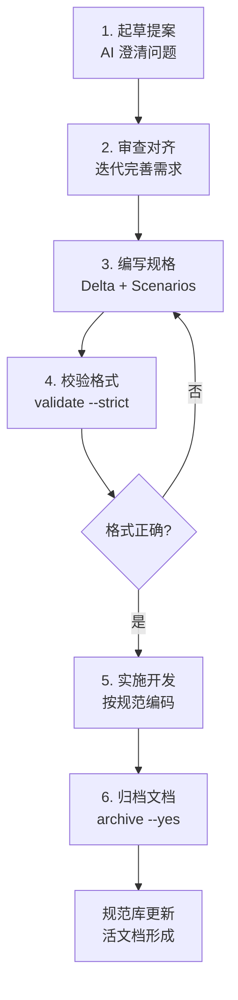

# OpenSpec 中文版规范助手

OpenSpec 是一个 CLI 工具，通过**规范驱动的开发流程**帮助开发者与 AI 编码助手建立明确的需求共识。核心理念是：**在编写代码前，先将需求文档化并达成一致**，从而消除 AI 工具仅依赖对话历史产生的不可预测输出。

## 什么是 OpenSpec

### 核心价值

- **准确性**：需求明确后大幅减少返工，避免 AI 理解偏差
- **可追溯性**：每个技术决策都有完整的文档记录
- **文档化**：自动生成的规范与代码保持同步，形成活文档
- **团队友好**：清晰的提案便于多人协作和 Code Review

### 适用场景

✅ **最适合**：

- 改进现有项目（1→n 开发，棕地项目）
- 需要高质量实现的关键功能
- 团队协作开发
- 使用 Claude Code、Cursor、Cline 等 AI 工具
- 需要长期维护的项目

❌ **不适合**：

- 快速原型验证（0→1 探索阶段）
- 一次性小脚本
- 需求极度不明确的创新性探索

### 实践价值

前期多花 10-15 分钟与 AI 澄清需求、编写规范，能节省数小时的返工时间。规范文档会随着项目演进不断积累，最终形成完整的系统文档。

## 双文件夹模型

OpenSpec 使用独特的**双文件夹模型**，将"事实"与"提案"分离：

```plain
openspec/
├── specs/          # 📚 事实：已实施并归档的规范（source-of-truth）
│   ├── auth.md
│   ├── api.md
│   └── database.md
└── changes/        # 💡 提案：待实施的变更（明确的差异管理）
    ├── add-oauth-login/
    │   ├── proposal.md
    │   ├── tasks.md
    │   └── specs/
    │       └── auth-delta.md
    └── optimize-api-cache/
        ├── proposal.md
        └── specs/
            └── api-delta.md
```

**设计理念**：

- `specs/` 是系统的当前状态
- `changes/` 是即将到来的变化
- 这种分离让"差异明确且可管理"，特别适合修改现有系统

## 环境与安装

### 基本要求

- **Node.js** >= 20.19.0（Node 22 也兼容）
- **无需 API 密钥**：完全本地执行，与现有开发工具集成

### 安装方式

**全局安装（推荐）**：

```bash
npm install -g @org-hex/openspec-chinese@latest
# 或使用 pnpm
pnpm install -g @org-hex/openspec-chinese@latest
```

**临时使用**（不安装）：

```bash
pnpm dlx @org-hex/openspec-chinese init
pnpm dlx @org-hex/openspec-chinese proposal "功能描述"
```

**验证安装**：

```bash
openspec-chinese --version
openspec-chinese --help
```

### 支持的 AI 工具

OpenSpec 支持 **20+ AI 编程助手**，包括：

- **原生斜杠命令**：Claude Code, Cursor, CodeBuddy, Cline 等
- **AGENTS.md 回退**：所有支持自定义指令的工具（通用兼容）

无需额外配置，安装后即可在所有支持的工具中使用。

## 项目初始化

### 初始化结构

```bash
# 在全新项目中初始化
openspec-chinese init

# 在现有 OpenSpec 项目中切换到中文版
openspec-chinese update
```

生成的完整结构：

```plain
openspec/
├── project.md      # 项目上下文（技术栈、架构、团队约定）
├── AGENTS.md       # AI 助手通用指令（20+ 工具兼容）
├── specs/          # 现行规范库（已归档的事实）
├── changes/        # 变更提案目录
└── templates/      # 自定义模板（可选）
```

**重要**：初始化后如果 IDE 里斜杠命令未出现，请重启 IDE/AI 工具。

### 补全 project.md

生成 `project.md` 后，应立即向 AI 提出：

```markdown
请阅读 openspec/project.md 并帮助我填写：

1. 项目的核心技术栈
2. 架构设计约定
3. 编码规范和最佳实践
4. 团队协作流程
```

完善的 `project.md` 能让 AI 助手更好地理解项目上下文，生成更符合实际的规范文档。

## 五阶段完整工作流程

### 阶段 1：起草提案（Draft Proposal）

**目标**：创建变更文件夹，初步定义需求

```bash
# 命令行方式
openspec-chinese proposal "添加 OAuth 登录功能"

# AI 工具斜杠命令
/openspec-proposal
```

**输出**：

```plain
openspec/changes/add-oauth-login/
├── proposal.md     # AI 生成的初步提案
├── tasks.md        # 任务分解清单
└── specs/          # 增量规范（空）
```

**交互要点**：

- AI 会提出澄清问题（例如："使用哪些 OAuth 提供商？"）
- 回答问题后，AI 生成详细的 `proposal.md` 和 `tasks.md`

### 阶段 2：审查对齐（Review & Align）

**目标**：人和 AI 共同审查，反复迭代直到需求明确

```bash
# 查看提案详情
openspec-chinese show add-oauth-login

# 在 AI 工具中交互
"请根据我的反馈修改 proposal.md：
1. 只支持 GitHub 和 Google OAuth
2. 需要处理现有用户的账号合并逻辑
3. 增加 OAuth 失败时的降级方案"
```

**迭代过程**：

1. 审查 `proposal.md` 的 Why/What/Impact
2. 检查 `tasks.md` 的任务拆解是否合理
3. 提出修改建议，让 AI 更新文档
4. 重复直到完全对齐

**关键**：这个阶段多花时间，后续实施会快很多。

### 阶段 3：编写规格（Write Specs）

**目标**：在 `specs/` 目录下编写符合格式的增量规范

```bash
# AI 工具中请求
"请为 add-oauth-login 变更编写规格文档，放在 specs/ 目录"
```

**规范格式**（详见下文"规格文档格式要求"）：

```markdown
## ADDED Requirements

### Requirement: OAuth 登录支持

系统 MUST 支持通过 GitHub 和 Google 进行 OAuth 登录。

#### Scenario: GitHub OAuth 登录成功

- **WHEN** 用户点击"使用 GitHub 登录"按钮
- **THEN** 系统跳转到 GitHub OAuth 授权页面
- **AND** 授权成功后返回并创建会话
```

### 阶段 4：校验与实施（Validate & Implement）

**校验格式**：

```bash
# 严格格式校验
openspec-chinese validate add-oauth-login --strict

# 中文格式专项校验（需配置）
npm run validate:chinese
```

**实施开发**：

```bash
# AI 工具中参考规范实施
"请参考 openspec/changes/add-oauth-login/specs/ 中的规范，
按照 tasks.md 的任务清单逐步实施功能"
```

**任务追踪**：

- 在 `tasks.md` 中勾选已完成的任务
- AI 会自动参考规范，减少理解偏差

### 阶段 5：归档与文档化（Archive & Document）

**目标**：将完成的变更合并到主规范库

```bash
# 查看所有变更
openspec-chinese list

# 归档已完成的变更
openspec-chinese archive add-oauth-login --yes
```

**效果**：

- `changes/add-oauth-login/` 的规范合并到 `specs/`
- 变更记录自动保存
- 形成活文档，与代码同步

### 流程图总览



## 规格文档格式要求

OpenSpec 使用**严格的格式规范**，确保 AI 和人都能准确理解需求。

### 核心原则

1. **Delta 分区**：使用英文标题标识变更类型
2. **强制关键词**：需求必须包含 MUST/SHALL/SHOULD
3. **Gherkin 场景**：使用英文关键字描述验收标准
4. **中英混合**：结构英文，描述中文

### 1. Delta 分区（必填）

**三种变更类型**：

```markdown
## ADDED Requirements

# 新增的能力

## MODIFIED Requirements

# 修改现有行为

## REMOVED Requirements

# 废弃的功能（需说明原因和迁移路径）
```

### 2. Requirement 语句规范

**格式**：

```markdown
### Requirement: [需求名称]

系统 [MUST/SHALL/SHOULD] [能力描述]。
```

**强制关键词**：

- **MUST** / **SHALL**：强制要求，不可妥协
- **SHOULD**：建议要求，可协商
- **MAY**：可选要求

**示例**：

```markdown
### Requirement: 用户搜索功能

系统 MUST 提供用户搜索功能，支持按用户名、邮箱、手机号进行模糊查询。

系统 SHOULD 在搜索结果中高亮匹配的关键词。
```

### 3. Scenario 场景描述（验收标准）

**格式**：

```markdown
#### Scenario: [场景名称]

- **WHEN** [前置条件]
- **THEN** [预期结果]
- **AND** [额外条件/结果]
```

**要求**：

- 每个 Requirement 至少有一个 Scenario
- 使用**英文 Gherkin 关键字**（WHEN/THEN/AND/GIVEN）
- 描述内容可以是中文

**示例**：

```markdown
#### Scenario: 按邮箱搜索用户

- **WHEN** 用户在搜索框输入 "test@example.com"
- **THEN** 系统返回邮箱包含该字符串的用户列表
- **AND** 列表按相关度排序
- **AND** 邮箱中的匹配部分高亮显示

#### Scenario: 搜索无结果

- **WHEN** 用户输入不存在的邮箱
- **THEN** 系统显示"未找到匹配用户"
- **AND** 提示用户检查输入或尝试其他搜索条件
```

### 4. 删除需求的特殊要求

删除需求时**必须**提供 Reason 和 Migration：

```markdown
## REMOVED Requirements

### Requirement: 用户密码明文存储

- **Reason**: 严重的安全隐患，违反 OWASP 安全规范
- **Migration**:
  1. 所有密码已迁移到 bcrypt 加密存储
  2. 用户首次登录时会自动升级密码加密方式
  3. 详细迁移指南：`docs/password-migration.md`
```

### 5. 修改需求的说明

修改现有功能时应说明变化：

```markdown
## MODIFIED Requirements

### Requirement: 用户列表分页

- **变化说明**: 将每页默认显示数量从 20 条调整为 50 条
- **原因**: 用户反馈每页 20 条过少，频繁翻页影响体验
- **影响范围**:
  - 前端分页组件
  - 后端 API 默认参数
  - 性能测试基准需重新评估

#### Scenario: 默认分页数量

- **WHEN** 用户访问用户列表页面
- **THEN** 系统默认每页显示 50 条记录
- **AND** 用户可以在设置中自定义每页条数（10/20/50/100）
```

### 6. 完整示例模板

```markdown
## ADDED Requirements

### Requirement: 用户数据导出功能

系统 MUST 提供用户数据导出功能，支持 CSV 和 JSON 两种格式。

#### Scenario: 导出为 CSV 格式

- **WHEN** 管理员点击"导出为 CSV"按钮
- **THEN** 系统生成包含所有用户数据的 CSV 文件
- **AND** 文件包含字段：用户名、邮箱、注册时间、最后登录时间、状态
- **AND** 文件名格式为 `users_export_YYYYMMDD_HHmmss.csv`

#### Scenario: 导出权限检查

- **WHEN** 非管理员用户尝试导出
- **THEN** 系统返回 403 Forbidden 错误
- **AND** 前端显示"权限不足"提示

#### Scenario: 大数据量导出

- **GIVEN** 系统有超过 10000 条用户记录
- **WHEN** 管理员点击导出
- **THEN** 系统显示"正在生成导出文件"进度提示
- **AND** 导出任务在后台异步执行
- **AND** 完成后通过邮件发送下载链接

## MODIFIED Requirements

### Requirement: 用户列表查询性能

- **变化说明**: 为用户表添加邮箱和手机号索引
- **原因**: 当前搜索性能在 10 万用户以上明显下降
- **预期效果**: 搜索响应时间从 2-3 秒降低到 < 500ms

## REMOVED Requirements

### Requirement: 用户密码明文存储

- **Reason**: 严重安全隐患，必须移除
- **Migration**:
  1. 所有密码已迁移到 bcrypt 加密（cost=10）
  2. 用户下次登录时自动完成迁移
  3. 详细文档：`docs/security/password-migration.md`
```

## 常用命令速查

### 项目管理

```bash
# 初始化全新项目
openspec-chinese init

# 更新/切换到中文版
openspec-chinese update

# 查看版本
openspec-chinese --version
```

### 变更管理

```bash
# 创建新提案
openspec-chinese proposal "功能描述"

# 查看所有变更
openspec-chinese list

# 查看特定变更详情
openspec-chinese show <change-name>

# 校验格式（严格模式）
openspec-chinese validate <change-name> --strict

# 归档已完成的变更
openspec-chinese archive <change-name> --yes
```

### AI 工具斜杠命令

在支持的 AI 工具（Claude Code, Cursor 等）中：

```bash
/openspec-proposal          # 创建新提案
/openspec-validate          # 校验当前变更
/openspec-archive           # 归档变更
```

## 自定义模板

### 创建模板

在 `openspec/templates/` 目录下创建自定义模板：

```bash
# 创建功能规格模板
openspec/templates/feature-spec.md

# 创建 API 规格模板
openspec/templates/api-spec.md

# 创建数据库变更模板
openspec/templates/db-migration-spec.md
```

### 模板示例

```markdown
<!-- openspec/templates/feature-spec.md -->

## ADDED Requirements

### Requirement: [功能名称]

系统 MUST [功能描述]。

#### Scenario: [主要场景]

- **WHEN** [前置条件]
- **THEN** [预期结果]
- **AND** [额外条件]

#### Scenario: [错误场景]

- **WHEN** [异常情况]
- **THEN** [错误处理]
- **AND** [用户提示]

## MODIFIED Requirements

（如有修改现有功能，在此说明）

## REMOVED Requirements

（如有废弃功能，在此说明原因和迁移路径）
```

### 使用模板

```bash
# 创建新变更时，从模板复制
cp openspec/templates/feature-spec.md openspec/changes/new-feature/specs/feature.md

# 然后填充具体内容
```

## 最佳实践

### 1. 提案阶段多花时间

- ✅ 与 AI 充分沟通，澄清所有疑问
- ✅ 详细拆解任务到可执行的粒度
- ✅ 确保 proposal.md 中的 Why/What/Impact 清晰
- ❌ 不要急于开始编码，需求不明会导致大量返工

### 2. 规格要具体可验证

- ✅ 每个需求至少有 1-2 个 Scenario
- ✅ Scenario 要具体，可直接转化为测试用例
- ✅ 包含正常流程和异常流程
- ❌ 避免模糊描述，如"系统应该快速响应"

### 3. 利用 validate 命令

```bash
# 每次编辑规格后立即校验
openspec-chinese validate <change> --strict

# 配置 Git pre-commit hook
npm run validate:chinese
```

### 4. 保持规范与代码同步

- ✅ 代码实现后，确保规范准确反映最终结果
- ✅ 如有偏差，更新规范或代码使其一致
- ✅ 归档前再次审查规范的准确性

### 5. 利用 project.md

```markdown
<!-- openspec/project.md -->

# 项目上下文

## 技术栈

- 前端: React 18 + TypeScript
- 后端: Node.js + Express
- 数据库: PostgreSQL 14

## 架构约定

- RESTful API 设计
- JWT 认证
- 统一错误处理中间件

## 编码规范

- ESLint + Prettier
- 函数式组件优先
- 使用 React Query 管理服务端状态
```

完善的 `project.md` 能让 AI 生成更符合项目规范的代码。

### 6. 版本兼容

OpenSpec 中文版与英文版**完全兼容**：

```bash
# 切换到中文版
openspec-chinese update

# 切换回英文版
openspec update
```

两个版本可以在团队中并存，规范文件格式完全一致。

## 常见问题排查

### 命令不可用

**症状**：`openspec-chinese: command not found`

**解决方案**：

```bash
# 检查是否在 PATH 中
which openspec-chinese  # Mac/Linux
where openspec-chinese  # Windows

# 检查 npm 全局 bin 路径
npm config get prefix

# 重新安装
npm uninstall -g @org-hex/openspec-chinese
npm install -g @org-hex/openspec-chinese@latest
```

### 斜杠命令未出现

**症状**：AI 工具中看不到 `/openspec-*` 命令

**解决方案**：

```bash
# 执行更新命令
openspec-chinese update

# 重启 IDE/AI 工具
# 检查是否生成了 AGENTS.md
ls openspec/AGENTS.md
```

### 校验报错

**常见错误**：

1. **缺少 Delta 分区**

   ```plain
   Error: Missing required Delta sections (ADDED/MODIFIED/REMOVED)
   ```

   解决：确保至少有一个 Delta 分区

2. **缺少 MUST/SHALL 关键词**

   ```plain
   Error: Requirement missing mandatory keywords
   ```

   解决：在需求描述中添加 MUST/SHALL/SHOULD

3. **Scenario 层级错误**

   ```plain
   Error: Scenario must be under a Requirement
   ```

   解决：确保 `#### Scenario:` 在 `### Requirement:` 之下

4. **Gherkin 关键字使用中文**
   ```plain
   Error: Gherkin keywords must be in English
   ```
   解决：使用 WHEN/THEN/AND 而非"当/那么/并且"

### 归档失败

**症状**：`openspec-chinese archive` 报错

**可能原因**：

- 变更未通过校验
- specs/ 目录为空
- Git 冲突

**解决方案**：

```bash
# 先校验格式
openspec-chinese validate <change> --strict

# 检查 specs/ 目录
ls openspec/changes/<change>/specs/

# 解决 Git 冲突后重试
git status
```

## 触发场景

本技能应在以下场景**主动调用**：

### 明确触发

1. 用户提及 "openspec"
2. 用户提及 "规范文档"、"需求文档"
3. 用户提及 "spec-driven development"
4. 用户询问如何管理需求

### 上下文触发

5. 用户开始新功能开发前（建议使用 OpenSpec）
6. 用户抱怨 AI 理解偏差或频繁返工
7. 用户询问如何让 AI 更准确理解需求
8. 用户需要生成技术文档

### 项目阶段触发

9. 项目初始化阶段（建议配置 OpenSpec）
10. 准备重大重构时（建议先写规范）
11. 团队协作场景（提供统一的需求描述）

## 执行长任务时的注意事项

1. **及时更新任务文件**：
   > **必须要**及时更新对应任务的 `tasks.md` 任务进度文件。避免出现大批量完成任务后，没有更新进度文件的情况，带来严重的误解。
2. 启动**多个子代理**分模块并行完成任务：
   > 务必要启动多个在后台运行的子代理，同时完成 openspec 设定的一系列繁杂的任务。以便加快速度。你应该至少同时启用至少 4 个子代理。并根据情况，主动增加足够数量的子代理完成任务。
3. 回复文本语言：
   > 务必用**中文**回复用户。
4. 上下文合并后重新阅读一次任务要求：
   > 为了避免你在自动合并上下文的时候，给后续的任务带来明显的幻觉，你应该及时的重新阅读 openspec 的任务规范要求。
5. 连续的，持续的执行长任务：
   - 你应该一次性完成 `tasks.md` 所记录的全部任务。你应该同时新建多个子代理，做出合理的任务划分，一次性完成任务。
   - 不要在完成一个任务的时候就停下来询问用户。这种停顿方式很低效率，你要避免这种执行方式。
6. **禁止**编写脚本完成批处理任务：
   - **不允许**你编写任何 Python、typescript、javascript，或 bash 脚本，完成大批量代码删改之类的任务。
   - 你应该阅读文件来完成更改，而不是使用不稳定的，容易带来语法错误的，删改不干净不合理的批处理脚本，来完成任务。
   - 你应该新建多个子代理，用具体的子代理来完成大规模的修改任务。
7. 主从代理的调度设计：
   - `主代理的职责`： 主代理应该负责全面的，完整的阅读来自 openspec 目录下全部的 markdown 文档任务要求。并按照模块和错误类型，新建足够数量的子代理。并持续监听，定期收集来自子代理的处理反馈。
   - `子代理的职责`： 子代理应该严格按照主代理给定的要求来完成任务。
8. 什么情况下应该新建子代理？在以下的几种情况下，主代理应该及时新建子代理来完成任务：
   - 大规模的代码探索与信息收集任务。
   - 访问 url 获取文档信息的任务。
   - 指定严格顺序的代码修改任务。
   - 报告编写任务。
   - 进度文件更新与编写任务。

## 注意事项

### 格式要求（严格遵守）

1. ✅ Delta 分区标题必须使用**英文**（ADDED/MODIFIED/REMOVED）
2. ✅ Gherkin 关键字必须使用**英文**（WHEN/THEN/AND/GIVEN）
3. ✅ 需求描述中必须包含 MUST/SHALL/SHOULD 等**强制关键词**
4. ✅ 删除需求时必须提供 **Reason** 和 **Migration**
5. ✅ 每个 Requirement 至少有**一个 Scenario**

### 工作流建议

1. ⏰ 提案阶段多花时间，实施阶段会快很多
2. 📝 规格要具体可验证，能直接转化为测试用例
3. ✅ 每次编辑后立即运行 `validate --strict`
4. 🔄 保持规范与代码同步，归档前再次审查
5. 📚 善用 `project.md` 提供项目上下文

### 团队协作

1. 👥 规范文件适合 Code Review
2. 📖 `changes/` 目录中的提案可作为 PR 描述
3. 🔍 归档后的 `specs/` 成为团队共识
4. 🌍 中英文版本可并存，格式完全兼容

### 工具集成

1. 🤖 支持 20+ AI 编程工具，无缝集成
2. 🔒 完全本地执行，无需 API 密钥
3. 📂 AGENTS.md 提供通用兼容性
4. ⚡ 斜杠命令提供快捷操作

---

## 参考资源

- **OpenSpec 中文版仓库**: https://github.com/hex-novaflow-ai/OpenSpec-Chinese
- **OpenSpec 原版仓库**: https://github.com/Fission-AI/OpenSpec
- **介绍教程**: https://www.aivi.fyi/llms/introduce-OpenSpec
- **官方文档**: 项目 README 和 docs 目录
