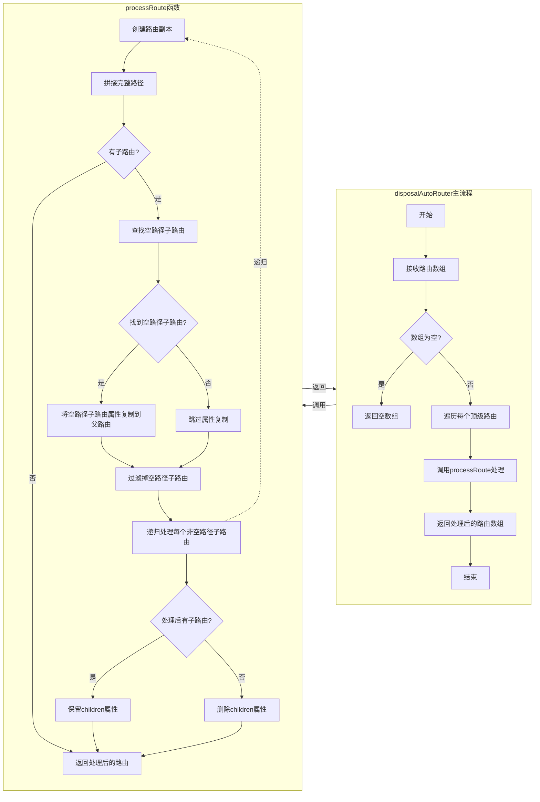

# 处理自动路由提供的路由对象

## 功能介绍

`disposalAutoRouter` 函数用于处理来自 `vue-router/auto-routes` 提供的路由数据，解决自动生成路由时产生的"脏数据"问题。主要功能包括：

1. 将空路径子路由（`path: ""`）的信息提取到父级路由
2. 拼接子路由的完整路径，例如将 `message-center` 拼接为 `/message-middle/message-center`
3. 删除空路径路由和空 `children` 数组
4. 保留正常路由结构，生成符合规范的嵌套路由配置

## 工作流程

整个处理过程分为两个主要函数：

### disposalAutoRouter 函数

该函数作为入口，接收一个路由数组，并对每个顶级路由调用 `processRoute` 函数进行处理。

```typescript
export function disposalAutoRouter(routes: RouteRecordRaw[]): RouteRecordRaw[] {
	if (!Array.isArray(routes) || routes.length === 0) {
		return [];
	}

	// 处理所有顶级路由
	return routes.map((route) => processRoute(route));
}
```

### processRoute 函数

这是核心处理逻辑，采用递归方式处理嵌套路由。流程如下：

1. 创建路由副本，避免修改原始对象
2. 拼接完整路径（合并父路径和当前路径）
3. 处理子路由：
   - 查找空路径子路由（`path: ""`）
   - 使用 `lodash-es` 的 `omit` 函数，将空路径子路由的除 `path` 外所有属性复制到父路由
   - 过滤掉空路径子路由
   - 递归处理剩余的子路由，拼接完整路径
   - 如果处理后没有子路由，则删除 `children` 属性
4. 返回处理后的路由对象

## 数据流转图



## 数据转换示例

### 输入数据（原始路由）

```js
const routeFromAutoRouter = {
	path: "/message-middle",
	children: [
		{
			path: "",
			name: "message-middle",
			meta: {
				menuType: "folder",
				text: "消息中间件",
				icon: "IconMessage",
			},
			alias: [],
		},
		{
			path: "message-center",
			children: [
				{
					path: "",
					name: "message-middle-message-center",
					meta: {
						menuType: "page",
						text: "消息中心",
						icon: "IconMessage",
					},
					alias: [],
				},
			],
		},
	],
};
```

### 输出数据（处理后的路由）

```js
const processedRoute = {
	path: "/message-middle",
	name: "message-middle", // 从空路径子路由获取
	meta: {
		// 从空路径子路由获取
		menuType: "folder",
		text: "消息中间件",
		icon: "IconMessage",
	},
	alias: [], // 从空路径子路由获取
	children: [
		{
			path: "/message-middle/message-center", // 路径已拼接完整
			name: "message-middle-message-center",
			meta: {
				menuType: "page",
				text: "消息中心",
				icon: "IconMessage",
			},
			alias: [],
		},
	],
};
```

## 关键技术点

1. **递归处理**：通过递归处理嵌套路由，确保所有层级的路由都能正确处理
2. **属性复制**：使用 `lodash-es` 的 `omit` 函数配合 `Object.assign`，确保完整复制除 `path` 外的所有属性
3. **路径拼接**：智能拼接父路径和子路径，生成完整的路由路径
4. **数据清理**：删除空路径子路由和空的 `children` 数组，保持数据整洁

## 使用场景

该函数主要用于处理自动生成的路由配置，特别适用于：

1. 使用 `unplugin-vue-router` 等插件自动生成的路由配置
2. 需要将文件夹结构转换为路由结构的场景
3. 需要规范化路由配置的场景
