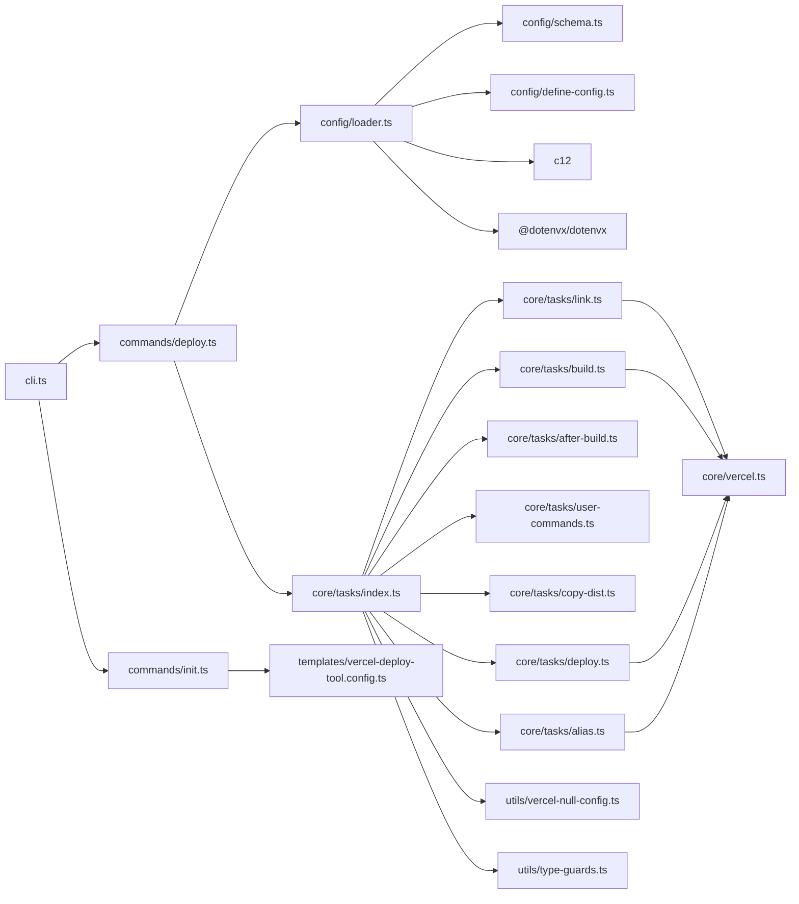
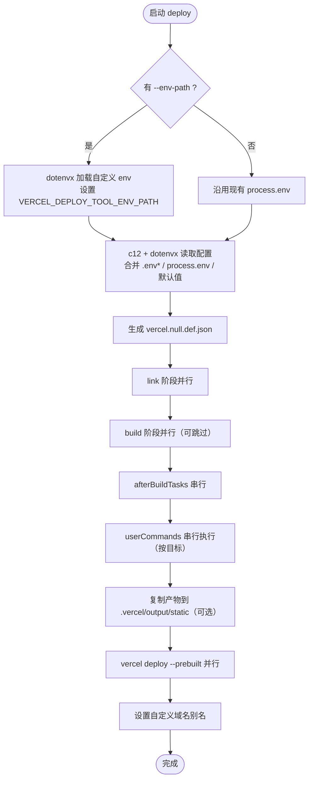

# vercel-deploy-tool 架构说明

面向 monorepo 的 Vercel 部署工具，提供 CLI 与可编程 API，支持多目标并行部署（static / userCommands）。下文描述目录职责、模块引用关系与运行流程。

## 目录与职责

- `src/cli.ts`：CLI 入口，注册 `deploy`、`init` 命令。
- `src/commands/deploy.ts`：处理 `--env-path`，调用配置加载与部署流水线。
- `src/commands/init.ts`：生成模板配置、写入 package.json 脚本。
- `src/config/schema.ts`：配置类型定义。
- `src/config/define-config.ts`：`defineConfig` 帮助函数。
- `src/config/loader.ts`：基于 `c12` 加载 `vercel-deploy-tool.config.ts`，合并 `.env*`、`process.env`、`VERCEL_DEPLOY_TOOL_ENV_PATH`/`--env-path` 指定的 dotenv。
- `src/templates/vercel-deploy-tool.config.ts`：配置模板。
- `src/core/tasks/*`：基于 `tasuku` 的流水线（link/build/after-build/user-commands/copy-dist/deploy/alias）。
- `src/core/vercel.ts`：封装 vercel CLI 参数。
- `src/utils/vercel-null-config.ts`：生成空配置文件，驱动 Build Output API。
- `src/utils/type-guards.ts`：类型守卫与默认值处理。
- `src/index.ts`：对外导出 API、类型与命令工厂。

## 模块引用图

## 运行流程（deploy）

## 环境变量与 dotenv

- 优先级：`--env-path`/`VERCEL_DEPLOY_TOOL_ENV_PATH` 指定的 dotenv > 现有 `process.env` > `c12` 自动加载的 `.env*` > 配置默认值。
- 多文件场景建议使用：`dotenvx run -f .env.test -f .env.test-2 -- vdt deploy`。

## 配置文件要点

- 位置：仓库根目录 `vercel-deploy-tool.config.ts`，通过 `defineConfig` 返回。
- 核心字段：`vercelProjectName`、`vercelToken`、`vercelOrgId`、`vercelProjectId`、`deployTargets`。
- 目标类型：
  - `static`：直接复制已有产物。
  - `userCommands`：先执行构建命令，再按 `outputDirectory` 复制到 `.vercel/output/static`，`isCopyDist` 控制复制，`isNeedVercelBuild` 控制是否执行 `vercel build`。

## 命令速览

- `vdt init` / `vercel-deploy-tool init`：生成配置模板并写入 `deploy-vercel` 脚本。
- `vdt deploy [--env-path <path>]`：执行完整部署流水线，支持指定 dotenv。
