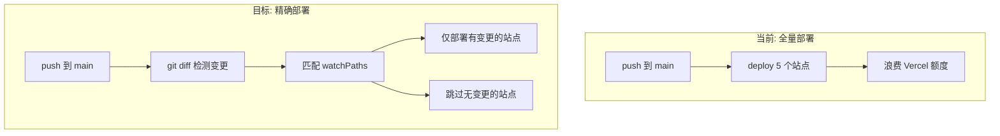
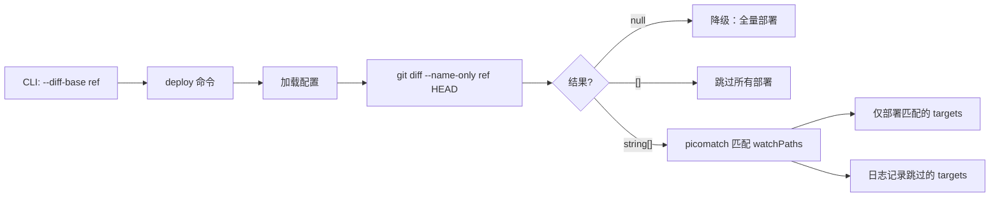

> **归档说明**：本文件由 Cursor 计划 `精确部署方案设计_9ec97042.plan.md` 迁入 `packages/vercel-deploy-tool/src/docs/plan/`，与包文档一并维护。正文内相对链接（如 `vercel-deploy-tool.config.ts`）以 **monorepo 仓库根目录** 为基准。
>
> **与实现对齐**：以下正文已按落代码更新（含 `getChangedFiles` 的 `null` 降级语义、tasuku 步骤 0、CI `else` 分支等）。用户指南见 [selective-deploy.md](../selective-deploy.md)。

# 基于 Git Diff 的精确部署方案

## 问题分析

当前部署流程中，推送到 `main` 分支后，[vercel-deploy-tool.config.ts](vercel-deploy-tool.config.ts) 中配置的 **5 个文档站全部被部署**，即使只改了一个包。workflow 的 `paths` 过滤器只控制"是否触发整个 workflow"，无法控制"部署哪些 target"。



## 方案设计

### 核心机制

在 `vercel-deploy-tool` 内部实现 git diff 过滤能力，通过以下协作点实现：

1. **配置层** - 每个 `DeployTarget` 新增可选 `watchPaths` 字段（glob，相对 monorepo 根）
2. **工具层** - `git-diff-filter`：`getChangedFiles` + `filterTargetsByDiff`（picomatch）
3. **CLI / API 层** - `deploy` 命令与 `executeDeploymentWorkflow(config, options)` 的 `DeploymentWorkflowOptions`
4. **编排层** - tasuku 根任务内 **步骤 0** 汇总 `finalTargets`，后续步骤仅处理过滤后的目标
5. **CI 层** - workflow 按事件传入 `--diff-base`，未知事件回退为全量 `pnpm run deploy`

### 数据流



## 具体改动

### 1. Schema 扩展 - [packages/vercel-deploy-tool/src/config/schema.ts](packages/vercel-deploy-tool/src/config/schema.ts)

`DeployTargetBase` 新增 `watchPaths` 字段：

```typescript
export interface DeployTargetBase {
	type: DeployTargetType;
	targetCWD: `./${string}`;
	url: string[];
	isNeedVercelBuild?: boolean;

	/**
	 * 监控路径（glob 模式）
	 * @description
	 * 配置后，部署前会通过 git diff 检测这些路径是否有变更。
	 * 仅在有变更时才部署该目标。未配置则始终部署（向后兼容）。
	 * @example ["packages/utils/**"]
	 * @example ["packages/utils/src/docs/**", "packages/utils/src/.vitepress/**"]
	 */
	watchPaths?: string[];
}
```

### 2. 新增 git diff 过滤模块 - `packages/vercel-deploy-tool/src/core/git-diff-filter.ts`

- `ChangedFilesResult`：`string[] | null`。`null` 表示 git 不可用、ref 无效或执行失败，调用方 **降级为全量部署**；`[]` 表示 git 成功但无变更文件；非空数组为变更路径列表。
- `getChangedFiles(diffBase: string): ChangedFilesResult` - 执行 `git diff --name-only <diffBase> HEAD`；`diffBase` 为空字符串时返回 `null`。
- `filterTargetsByDiff(targets, changedFiles): { deploy, skipped }` - 使用 `picomatch` 匹配 `watchPaths`，分离需要部署与跳过的 targets。
- 当 target **未配置** `watchPaths` 或为空数组时，默认纳入 **deploy**（向后兼容）。

### 3. 新增依赖 - [packages/vercel-deploy-tool/package.json](packages/vercel-deploy-tool/package.json)

添加 `picomatch` 作为 `dependencies`；`@types/picomatch` 作为 `devDependencies`（类型声明）。

### 4. CLI 参数扩展 - [packages/vercel-deploy-tool/src/commands/deploy.ts](packages/vercel-deploy-tool/src/commands/deploy.ts)

```typescript
command
	.option("--diff-base <ref>", "Git ref，与 HEAD 对比检测变更文件，仅部署有变更的目标")
	.option("--force-all", "强制部署所有目标，忽略 watchPaths 过滤（优先级高于 --diff-base）");
```

`deploy` 的 `action` 中将上述选项传入 `executeDeploymentWorkflow(config, { diffBase, forceAll })`。

### 5. 部署工作流集成 - [packages/vercel-deploy-tool/src/core/tasks/index.ts](packages/vercel-deploy-tool/src/core/tasks/index.ts)

对外导出 `DeploymentWorkflowOptions`（`diffBase?`、`forceAll?`）。`executeDeploymentWorkflow` 在完成空配置生成与 `availableTargets` 校验后，进入 **tasuku** 根任务；其中 **步骤 0** 为「检测变更范围」，用子任务的 `setTitle` 体现当前模式（全量 / 精确 / 降级 / 无变更），返回 `finalTargets`：

- `--force-all`：直接返回 `availableTargets`。
- 未传 `--diff-base`：全量部署，返回 `availableTargets`。
- `getChangedFiles` 返回 `null`：**降级全量**，返回 `availableTargets`。
- 返回 `[]`：**无文件变更**，子任务返回空数组，根任务提前结束并提示无需部署。
- 返回非空数组：调用 `filterTargetsByDiff`，日志输出跳过的目标，`setTitle` 展示 `精确部署: N / M 个目标`。

后续步骤 1～5（Link / Build / AfterBuild / UserCommands+CopyDist / Deploy+Alias）一律使用 `finalTargets`，不再使用未过滤的 `availableTargets`。

任务顺序（文档与代码注释一致）：

0. 检测变更范围（tasuku 子任务）
1. Link（并行）
2. Build（并行，可跳过）
3. AfterBuild（串行）
4. UserCommands + CopyDist（按目标）
5. Deploy + Alias（按目标）

### 6. 部署配置更新 - [vercel-deploy-tool.config.ts](vercel-deploy-tool.config.ts)

为每个 deploy target 配置 `watchPaths`：

```typescript
deployTargets: [
	{
		type: "static",
		targetCWD: "./packages/utils/src/.vitepress/dist",
		url: getDomains("utils"),
		watchPaths: ["packages/utils/**"],
	},
	{
		type: "static",
		targetCWD: "./packages/vitepress-preset-config/src/docs/.vitepress/dist",
		url: getDomains("vitepress-preset"),
		watchPaths: ["packages/vitepress-preset-config/**"],
	},
	{
		type: "static",
		targetCWD: "./packages/claude-notifier/src/docs/.vitepress/dist",
		url: getDomains("claude-notifier"),
		watchPaths: ["packages/claude-notifier/**"],
	},
	{
		type: "static",
		targetCWD: "./packages/domains/docs/.vitepress/dist",
		url: getDomains("domain"),
		watchPaths: ["packages/domains/**"],
	},
	{
		type: "static",
		targetCWD: "./packages/vercel-deploy-tool/src/docs/.vitepress/dist",
		url: getDomains("vercel-deploy-tool"),
		watchPaths: ["packages/vercel-deploy-tool/**"],
	},
];
```

### 7. GitHub Workflow 更新 - [.github/workflows/vercel-deploy-tool.yaml](.github/workflows/vercel-deploy-tool.yaml)

修改部署命令，传入 `--diff-base`：

```yaml
- name: 运行自写的vercel部署工具
  run: |
    curl -sfS https://dotenvx.sh/install.sh | sh
    if [ "${{ github.event_name }}" = "push" ]; then
      pnpm dotenvx run -- pnpm run deploy -- --diff-base ${{ github.event.before }}
    elif [ "${{ github.event_name }}" = "repository_dispatch" ]; then
      pnpm dotenvx run -- pnpm run deploy -- --diff-base ${{ github.event.client_payload.sha }}~1
    else
      pnpm dotenvx run -- pnpm run deploy
    fi
```

- **push 事件**：`github.event.before` 是 main 分支推送前的 SHA，完美覆盖 rebase 带来的多 commit 场景
- **dispatch 事件**：使用 `client_payload.sha` 的父提交作为基准，精确检测发版引起的变更

### 8. 根 package.json 部署命令 - [package.json](package.json)

当前 `"deploy-vercel"` 直接用 tsx 运行 cli.ts，需要确保 `--diff-base` 参数能透传：

```json
"deploy-vercel": "tsx ./packages/vercel-deploy-tool/src/cli.ts deploy"
```

此命令本身不需要改动，`--` 后的参数会透传给 deploy 命令。

## 向后兼容性

- `watchPaths` 是可选字段，不配置则行为与当前完全一致（始终部署）。
- `--diff-base` 是可选参数，不传则不做过滤，全量部署。
- `--force-all` 提供紧急全量部署的逃生通道。
- **git 不可用或 diff 失败**：`getChangedFiles` 返回 `null`，流水线 **降级为全量部署**，避免在无 git 环境下误跳过全部站点。

## 文件变更清单

- 修改: `packages/vercel-deploy-tool/src/config/schema.ts` - 扩展 `DeployTargetBase`（`watchPaths`）
- 新增: `packages/vercel-deploy-tool/src/core/git-diff-filter.ts` - `getChangedFiles`、`filterTargetsByDiff`
- 修改: `packages/vercel-deploy-tool/src/commands/deploy.ts` - `--diff-base`、`--force-all`，传入 `executeDeploymentWorkflow`
- 修改: `packages/vercel-deploy-tool/src/core/tasks/index.ts` - `DeploymentWorkflowOptions`、tasuku 步骤 0、`finalTargets`
- 修改: `packages/vercel-deploy-tool/package.json` - `picomatch`、`@types/picomatch`
- 新增: `packages/vercel-deploy-tool/tests/git-diff-filter.test.ts` - 单元测试
- 修改: `vercel-deploy-tool.config.ts` - 各目标 `watchPaths`
- 修改: `.github/workflows/vercel-deploy-tool.yaml` - 按事件传入 `--diff-base`，`else` 全量部署
- 文档: `src/docs/selective-deploy.md`、`architecture.md`、`migration-guide.md`；本归档 `src/docs/plan/精确部署方案设计.md`
