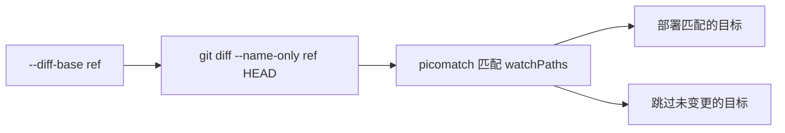

# 精确部署：基于 Git Diff 的按需部署

在 monorepo 中，一次推送往往只涉及少数几个子包的变更，但如果每次都将所有文档站全量部署，会造成 Vercel 部署额度的大量浪费。

`vercel-deploy-tool` 提供了基于 Git Diff 的精确部署能力：通过分析 git 变更范围，自动识别哪些文档站需要重新部署，哪些可以跳过。

## 工作原理



部署前，工具会执行 `git diff --name-only <diffBase> HEAD` 获取所有变更文件，再用每个部署目标的 `watchPaths` glob 模式进行匹配：

- **有匹配的文件** → 部署该目标
- **无匹配的文件** → 跳过该目标
- **未配置 `watchPaths`** → 始终部署（向后兼容）

## 配置 watchPaths

在 `vercel-deploy-tool.config.ts` 的每个 `deployTargets` 条目上添加 `watchPaths` 字段：

```typescript
import { defineConfig } from "@ruan-cat/vercel-deploy-tool";

export default defineConfig({
	// ...Vercel 项目信息...
	deployTargets: [
		{
			type: "static",
			targetCWD: "./packages/utils/src/.vitepress/dist",
			url: ["utils.example.com"],
			// 监控整个 utils 包目录：只要该目录下有任何文件变更，就部署这个站点
			watchPaths: ["packages/utils/**"],
		},
		{
			type: "static",
			targetCWD: "./packages/docs/src/.vitepress/dist",
			url: ["docs.example.com"],
			// 仅监控文档相关目录：代码变更不触发部署，只有文档内容变更才触发
			watchPaths: ["packages/docs/src/docs/**", "packages/docs/src/.vitepress/**"],
		},
		{
			type: "static",
			targetCWD: "./demos/landing/.vitepress/dist",
			url: ["landing.example.com"],
			// 不配置 watchPaths：每次都会部署（向后兼容行为）
		},
	],
});
```

### watchPaths 路径规范

- 路径相对于 **monorepo 根目录**，与 `git diff` 输出的路径一致
- 支持完整的 glob 语法（由 [picomatch](https://github.com/micromatch/picomatch) 提供）
- 可配置多个模式，任意一个匹配即触发部署

```typescript
// 匹配整个包目录
watchPaths: ["packages/my-pkg/**"];

// 仅匹配文档和配置文件
watchPaths: ["packages/my-pkg/src/docs/**", "packages/my-pkg/src/.vitepress/**", "packages/my-pkg/README.md"];

// 匹配多个相关包（适用于共享组件库场景）
watchPaths: ["packages/ui/**", "packages/ui-docs/**"];
```

## CLI 参数

### --diff-base \<ref\>

指定 Git 比较基准。工具会对比 `<ref>` 与 `HEAD` 之间的变更文件，再匹配各目标的 `watchPaths`。

```bash
# 与上一个 commit 对比
vdt deploy --diff-base HEAD~1

# 与指定 commit SHA 对比
vdt deploy --diff-base abc1234

# 与指定分支对比
vdt deploy --diff-base main
```

**不传此参数时**：不做任何过滤，全量部署所有目标（与旧版行为一致）。

### --force-all

强制全量部署所有目标，忽略 `watchPaths` 过滤。即使传入了 `--diff-base`，也会部署全部目标。

```bash
vdt deploy --diff-base HEAD~1 --force-all
```

适合在发版、紧急修复等场景下强制刷新全部站点。

## 降级行为

工具在以下情况会自动降级，保证部署不会因为 git 环境问题而中断：

| 情况                          | 行为                         |
| ----------------------------- | ---------------------------- |
| git 命令不存在                | 降级为全量部署，打印警告     |
| `--diff-base` 指定的 ref 无效 | 降级为全量部署，打印警告     |
| git diff 执行返回非零退出码   | 降级为全量部署，打印警告     |
| git 成功且无变更文件          | 跳过所有部署（确实无需部署） |
| 目标的 `watchPaths` 无匹配    | 跳过该目标                   |

## 在 GitHub Actions 中使用

结合 `github.event.before`（push 前的 commit SHA）传入 `--diff-base`，实现 CI 中的精确部署：

```yaml
- name: 精确部署到 Vercel
  run: |
    if [ "${{ github.event_name }}" = "push" ]; then
      # push 事件：以推送前的 SHA 为基准
      pnpm run deploy -- --diff-base ${{ github.event.before }}
    elif [ "${{ github.event_name }}" = "repository_dispatch" ]; then
      # 发版触发：以发布 commit 的父提交为基准
      pnpm run deploy -- --diff-base ${{ github.event.client_payload.sha }}~1
    else
      # 其他触发方式：全量部署
      pnpm run deploy
    fi
```

- **`github.event.before`**：`push` 事件中，推送前分支末尾的 commit SHA，能覆盖 rebase 带来的多 commit 场景
- **`github.event.client_payload.sha`**：`repository_dispatch` 事件（通常由发版 CI 触发）中，携带发版 commit SHA，取其父提交 `~1` 作为基准

## 任务输出示例

运行时，精确部署会在步骤 0 中显示检测结果：

```plain
Vercel 部署工作流
  ✔ 0. 精确部署: 2 / 5 个目标     ← 5 个目标中，2 个有变更需要部署
  ✔ 1. Link 项目
  ✔ 2. 构建项目
  ✔ 3. 执行 AfterBuild 任务
  ✔ 4. 执行用户命令与文件复制
  ✔ 5. 部署与设置别名
```

全量部署场景（未指定 `--diff-base` 或 `--force-all`）：

```plain
Vercel 部署工作流
  ✔ 0. 全量部署（未指定 --diff-base）
  ✔ 1. Link 项目
  ...
```

无变更场景：

```plain
Vercel 部署工作流
  ✔ 0. 无文件变更，跳过所有部署
```
