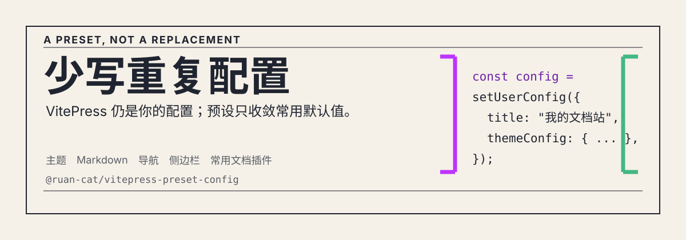

<p align="center">
  
</p>

<h1 align="center">@ruan-cat/vitepress-preset-config</h1>

<p align="center">面向中文技术文档站的 VitePress 配置预设：先获得一套可用默认值，再只覆盖你的站点差异。</p>

<!-- automd:badges color="yellow" name="@ruan-cat/vitepress-preset-config" -->

[](https://npmjs.com/package/@ruan-cat/vitepress-preset-config)
[](https://npm.chart.dev/@ruan-cat/vitepress-preset-config)

<!-- /automd -->

## 适合什么场景

- 想快速建立中文 VitePress 文档站，同时保留标准的 `.vitepress/config.mts` 配置方式。
- 希望自动生成导航与侧边栏，并按 Markdown 一级标题和 `frontmatter.order` 排序。
- 需要 Teek 主题、本地搜索、Mermaid、Demo、Twoslash、数学公式、Git 变更日志或 LLM 文档索引等常用能力。

这不是对 VitePress 的重新封装：你的 VitePress 配置依然是主入口；此包只提供默认值、约定功能和少量辅助函数。

## 安装依赖

<!-- automd:pm-install name="@ruan-cat/vitepress-preset-config" dev -->

```sh
# ✨ Auto-detect
npx nypm install -D @ruan-cat/vitepress-preset-config

# npm
npm install -D @ruan-cat/vitepress-preset-config

# yarn
yarn add -D @ruan-cat/vitepress-preset-config

# pnpm
pnpm add -D @ruan-cat/vitepress-preset-config

# bun
bun install -D @ruan-cat/vitepress-preset-config

# deno
deno install --dev npm:@ruan-cat/vitepress-preset-config
```

<!-- /automd -->

## 30 秒接入

安装预设及其 peer dependencies：

```sh
pnpm add -D @ruan-cat/vitepress-preset-config vitepress@^1.6 vue@^3.5 vitepress-demo-plugin@^1
```

在 `docs/.vitepress/config.mts` 中创建配置：

```ts
import { setGenerateSidebar, setUserConfig } from "@ruan-cat/vitepress-preset-config/config";

const config = setUserConfig({
	title: "我的文档站",
	description: "项目使用与开发文档",
});

config.themeConfig.sidebar = setGenerateSidebar({
	documentRootPath: "./docs",
});

export default config;
```

`setUserConfig()` 负责将你的标准 VitePress 配置与预设默认值深度合并；`setGenerateSidebar()` 在配置完成后生成侧边栏。Windows 上的 `documentRootPath` 必须使用类似 `"./docs"` 的相对路径。

## 预设默认提供

- **站点体验**：Teek 主题、中文界面文本、本地搜索、首页导航和 GitHub 社交链接。
- **Markdown 能力**：Demo、Mermaid、Twoslash、行号、数学公式，以及中文容器标题。
- **文档结构**：按一级标题和 `frontmatter.order` 生成折叠式侧边栏；`prompts/` 与 `CHANGELOG.md` 使用独立的导航与侧边栏逻辑。
- **扩展插件**：LLM 文档索引、Git 变更日志与 Markdown 变更日志区块默认开启，并可通过第二个参数关闭或配置。

## 常用入口

| 入口                                       | 用途                                                           |
| ------------------------------------------ | -------------------------------------------------------------- |
| `@ruan-cat/vitepress-preset-config/config` | `setUserConfig()` 与 `setGenerateSidebar()`                    |
| `@ruan-cat/vitepress-preset-config/theme`  | `defineRuancatPresetTheme()`，用于加载预设主题并追加自定义样式 |

## 使用前注意

- 适用于 VitePress `^1.6`、Vue `^3.5` 与 `vitepress-demo-plugin` `^1`。
- Git 变更日志默认指向本 monorepo。公开使用时请覆盖 `gitChangelog.repoURL`，或在 `extraConfig.plugins` 中关闭 Git 变更日志相关插件。
- 若需要完全不同的主题体系或完全控制所有 Vite/VitePress 插件，请直接从 VitePress 官方配置开始。

更多配置、功能说明和排错入口请访问 [在线文档](https://vitepress-preset.ruancat6312.top)。

## 许可证

[MIT](../../LICENSE)
