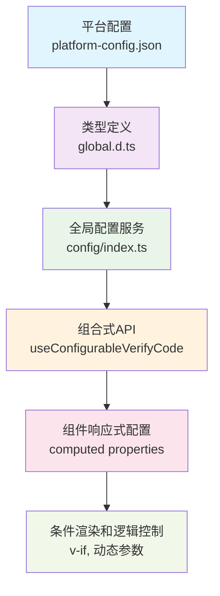

# mermaid 流程图功能

比如以下流程图；

```mermaid
flowchart TD
    A[平台配置<br/>platform-config.json] --> B[类型定义<br/>global.d.ts]
    B --> C[全局配置服务<br/>config/index.ts]
    C --> D[组合式API<br/>useConfigurableVerifyCode]
    D --> E[组件响应式配置<br/>computed properties]
    E --> F[条件渲染和逻辑控制<br/>v-if, 动态参数]

    style A fill:#e1f5fe
    style B fill:#f3e5f5
    style C fill:#e8f5e8
    style D fill:#fff3e0
    style E fill:#fce4ec
    style F fill:#f1f8e9
```

本包默认提供 mermaid 流程图渲染能力。
